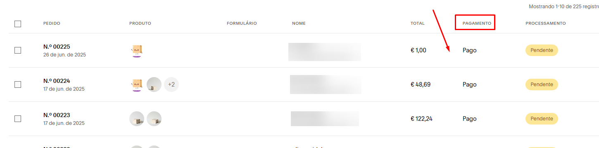
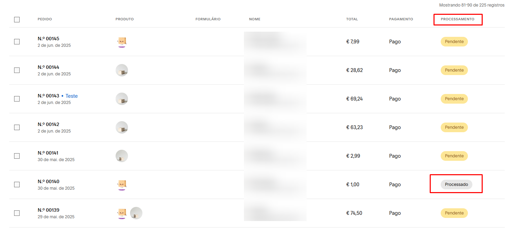

# Instalação do [checkout ifthenpay]

Este repositório contém um guia passo a passo para a instalação do [método de pagamento da ifthenpay ao cms squarespace], incluindo um script JavaScript que faz parte do processo.

> ⚠️ **Antes de começar:** para poder seguir esta documentação, não se esqueça de contactar o helpdesk da ifthenpay e solicitar uma gateway com o contexto `squarespace`.

---

## 📦 Conteúdo

- `checkoutSquarespace.pdf` – Documento com os passos detalhados.
- `js-cart.html` – o conteúdo deste ficheiro deve ser usado na instalação.

---

## ⚠️ Limitações

- **Sem suporte nativo do Squarespace:** A integração não tem suporte direto da Squarespace.

- **Configurações:** O cliente precisa de entrar no backoffice ifthenpay para realizar configurações manuais e autorizar a API da Ifthenpay vinculada ao Squarespace. Isto é necessário para que possamos ter as permissões necessárias para controlar alguns aspetos da loja, tais como: gerar encomendas, atualizar encomendas e listar produtos.

- **Script estático:** É necessário incluir um script JS no painel de controlo do Squarespace em [Site -> Páginas -> Código Personalizado -> Injeção de código -> Rodapé]. Este script tem como objetivo manipular a página do carrinho de compras para que seja possível implementar a nossa integração. Isto acontece porque o Squarespace não permite manipular o checkout, o que significa que não usaremos o checkout nativo da plataforma, mas sim um checkout externo da Ifthenpay. Basicamente, o script é responsável por obter os itens do carrinho de compras e também por identificar os eventos de adição ou subtração de itens. Ao clicar no botão "finalizar compra", em vez de ir para o checkout nativo, ele redireciona para o checkout externo da Ifthenpay.

- **Apenas os métodos de pagamento disponibilizados pela ithenpay:** Como não é possível manipular o checkout nativo, teremos de criar a nossa própria página de checkout, o cliente só poderá ter o nosso método de pagamento.

- **Controlo do carrinho:** Para evitar "carrinhos" abandonados, uma vez que ao finalizar iremos redirecionar a página, precisaremos de limpar o carrinho. Com isto, caso o utilizador chegue ao checkout e queira retornar ao carrinho, não será possível, pois este já estará vazio, e o utilizador terá de selecionar todos os itens novamente.

- **Limitação à configuração de envio do pedido:** Não vamos conseguir usar as configurações de envio nativas, pois o Squarespace não tem uma API que retorne as configurações que o cliente definiu no painel, e também não conseguimos obter as informações do checkout nativo. Dada esta informação, o cliente terá de definir as configurações de envio no backoffice, contudo, estas serão limitadas a: levantamento no local, envio com taxa fixa e/ou taxa por produto, e envio grátis acima de "X" valor (caso queira). Por exemplo: em compras acima de 100 euros, o envio é gratuito. (O envio é da responsabilidade do lojista; esta foi apenas uma alternativa criada para que ele possa cobrar pelo serviço, caso deseje).

- **Cupões de desconto:** Não é possível utilizar os cupões nativos do Squarespace, uma vez que estes só são aplicados no checkout da plataforma, que não é utilizado nesta integração. Como alternativa, os cupões são criados e geridos no backoffice da ifthenpay, onde o lojista define o desconto pretendido, sendo este aplicado no checkout da ifthenpay.

- **Estado de pagamento no CRM:** Ao gerar um pedido pela API do Squarespace, por padrão, ela marca o pedido como "pago" e não oferece uma alternativa para indicar que o pedido está pendente de pagamento, nem no momento da geração da ordem, nem ao atualizar. Assim, sempre que gerarmos uma ordem, ela aparecerá no painel como "paga".

  

- **Estado de processamento no CRM:** Como alternativa ao estado de pagamento, teremos de usar o estado de processamento para identificar qual encomenda já foi, de facto, paga. Assim, o estado de processamento ao gerar uma ordem será "pendente" e, assim que o pagamento for confirmado, iremos atualizar, através da API do Squarespace, o estado para "processado".

  

- **Limite de encomendas por hora:** Como o checkout é feito externamente no nosso servidor, precisamos de gerar o pedido através da API disponibilizada pelo Squarespace. No entanto, essa API tem um limite de apenas 100 pedidos por hora.
